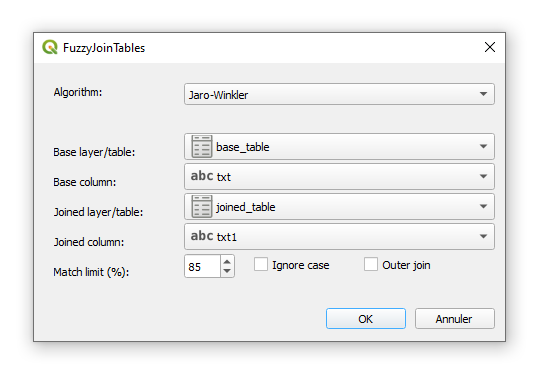

# Fuzzy Join Tables

Plugin for QGIS to join two tables based on maximal fuzzy match.

## Algorithms

The plugin supports two distance algorithms:

- **Damerau-Levenshtein Distance**: Measures the number of single-character edits needed to change one string into the other. It considers insertions, deletions, substitutions, and adjacent character transpositions. 
  See: [Damerau-Levenshtein Distance](https://en.wikipedia.org/wiki/Damerau-Levenshtein_distance)
- **Jaro-Winkler Distance**: For comparing short strings, particularly effective for matching names. It gives more weight to initial character matches and handles small typos also. 
  See: [Jaro-Winkler Distance](https://en.wikipedia.org/wiki/Jaro%E2%80%93Winkler_distance)

## Usage

The plugin adds an option to the **Vector** menu and an icon to the Plugins Toolbar. Launching the plugin opens a dialog box where you can configure the fuzzy join operation.

### Parameters

- **Base layer/Table** 
  Select the vector layer or table to join to, from the dropdown list.

- **Base column** 
  Select the field to join to. All comparisons are performed as strings.

- **Joined layer/Table** 
  Select the layer or table to join with the base layer.

- **Joined column** 
  Select the field to match against the base column.

- **Distance algorithm** 
  Choose either *Damerau-Levenshtein* or *Jaro-Winkler* for the fuzzy match.

- **Match limit (%)** 
  Set the minimum acceptable match rate (0-100%).

- **Ignore case** 
  If checked, the comparison will be case insensitive.

- **Outer join** 
  If checked, a left outer join is performed — all rows from the base table will appear in the result, even if no match is found in the joined table.

Pressing **OK** will create a new memory layer called *FuzzyJoin*. This layer contains the base layer's geometry (if present) and attributes from both tables. The joined table’s attributes are prefixed with `joined_` to avoid name conflicts. 
A column named `joined_match` is also added, showing the computed match rate (1 for a perfect match).

---

## Example

We have two small tables with Hungarian postal addresses, containing some typos:

### Base table

| id | txt                  |
| -- | -------------------- |
|  1 | Karcag utca 37.      |
|  2 | Kunhegyes utca 2.    |
|  3 | Derzsi utca 43       |
|  4 | Szalóki utca 24.     |

### Joined table

| id | txt1                 |
| -- | -------------------- |
|  1 | Karczag utca 35.     |
|  2 | KunHegyes u. 2       |
|  3 | Derzs utca 40.       |
|  4 | Szaloky utca 24.     |

---

### Example results

#### Damerau-Levenshtein with 85% match limit (case sensitive, inner join)

| id | txt                  | joined_id | joined_txt1      | joined_match |
| -- | -------------------- | --------- | ---------------- | ------------ |
|  1 | Karcag utca 37.      | 1         | Karczag utca 35. | 0.875        |
|  4 | Szalóki utca 24.     | 4         | Szaloky utca 24. | 0.875        |

---

#### Jaro-Winkler with 85% match limit (case insensitive, outer join)

| id | txt                  | joined_id | joined_txt1      | joined_match |
| -- | -------------------- | --------- | ---------------- | ------------ |
|  1 | Karcag utca 37.      | 1         | Karczag utca 35. | 0.912        |
|  2 | Kunhegyes utca 2.    | 2         | KunHegyes u. 2   | 0.893        |
|  3 | Derzsi utca 43       | 3         | Derzs utca 40.   | 0.875        |
|  4 | Szalóki utca 24.     | 4         | Szaloky utca 24. | 0.908        |

---

This flexibility makes the plugin useful in a variety of data integration tasks, such as merging address lists from different sources, resolving typos in names, and general data cleaning workflows.
